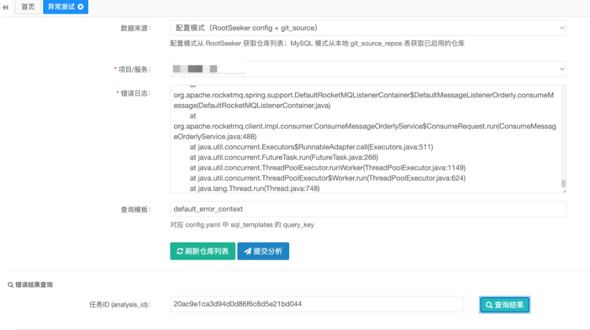
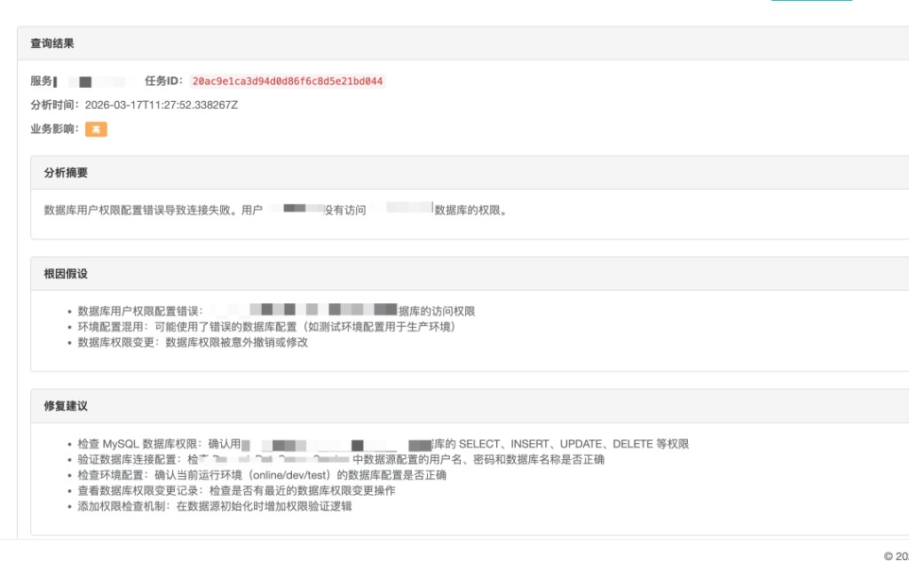
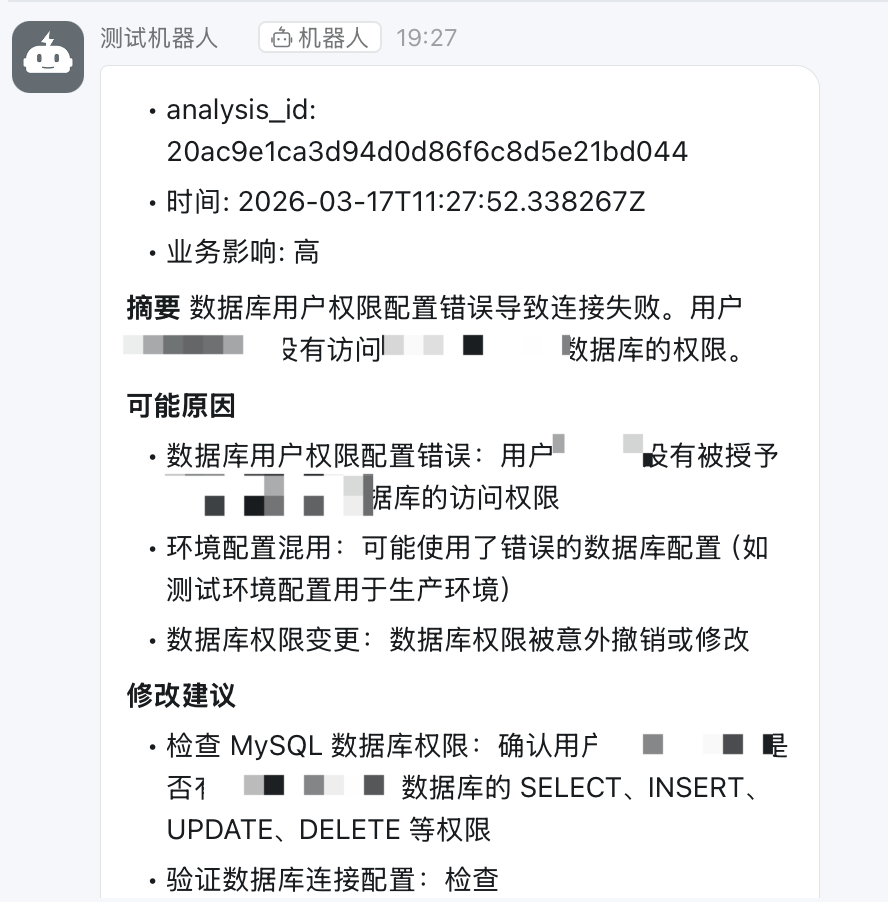
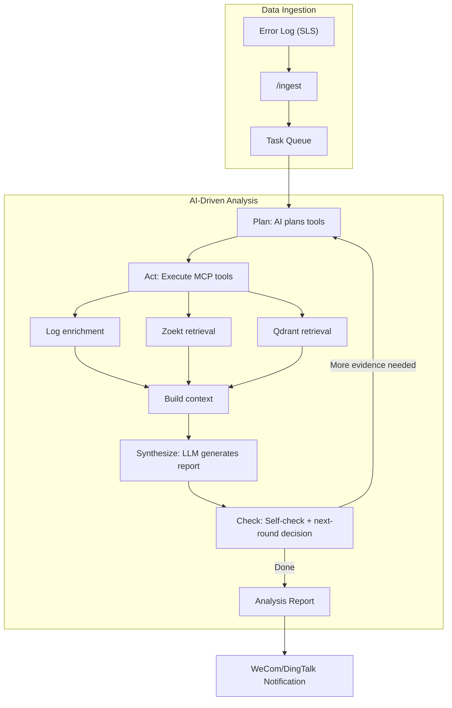

# RootSeeker

<p align="center">
    
    
    
    
</p>

<p align="center">
  <strong><a href="README.md">中文</a></strong> | <strong><a href="README.en.md">English</a></strong>
</p>

**RootSeeker** is an **AI-driven error analysis and root cause discovery service** for internal company networks. It helps you **say goodbye to "psychic" debugging**: starting from a single error log, it automatically reconstructs the failure scene, locates problematic code, and generates expert-level repair suggestions, approaching the root cause step by step like a human expert.

**Core value**: Free developers from tedious evidence collection; use AI to quickly locate root causes, shorten troubleshooting time, and reduce losses from production incidents. AI autonomously plans tool calls, collects evidence, and performs multi-turn reasoning to produce actionable root cause reports within 30 seconds. Supports private deployment—code and logs never leave your intranet.

**What you get**: No more guessing at error stacks; automatic TraceID correlation to pull full-link context (API inputs, SQL, RPC); build private code indexes for semantic search that understands business intent; analysis reports pushed in real-time to WeCom/DingTalk, saving troubleshooting time and improving incident response.

v3.0.0 supports dual orchestration modes—**Plan-Act** and **tool_use_loop**—coordinating **MCP Gateway**, **SLS**, **Zoekt**, **Qdrant**, and **LLM** for automated root cause discovery.

> **If this project helps you, please give it a Star ⭐️, your support is our motivation!**

> 📮 **Rapid iteration**: If you have any needs or suggestions, please submit via [Issues](https://gitee.com/icey_1/root_seeker/issues). We prioritize your feedback. Contact: **wuhun0301@qq.com**

---

## 📸 Project Screenshots

**Exception Test UI**: Configure data sources, input error logs, select query template, and submit for analysis.

<p align="center">
  
</p>

**Analysis Result Example**: AI analysis summary, root cause hypotheses, and repair suggestions.

<p align="center">
  
</p>

**WeCom/DingTalk Notification**: Analysis reports pushed in real-time to group chats, including summary, possible causes, and modification suggestions.

<p align="center">
  
</p>

---

## 📚 Table of Contents

- [Project Screenshots](#-project-screenshots)
- [Why Choose RootSeeker?](#-why-choose-rootseeker)
- [Key Features](#-key-features)
- [v3.0.0 Architecture](#-v300-architecture)
  - [Plan-Act vs tool_use_loop](#plan-act-vs-tool_use_loop)
- [How It Works](#-how-it-works)
- [Quick Start](#-quick-start)
- [Configuration](#-configuration)
- [Deployment Docs](#-deployment-docs)
- [API Reference](#-api-reference)
- [Case Study](#-case-study)
- [Contributing](#-contributing)
- [License](#-license)

---

## 🚀 Why Choose RootSeeker?

Traditional troubleshooting often relies on manual experience, requiring SREs to switch back and forth between log platforms, monitoring systems, and IDEs, which is time-consuming and laborious. RootSeeker aims to solve the following pain points:

*   **Goodbye "Psychic" Debugging**: No more guessing at error stacks; directly locate specific code lines.
*   **Holographic Scene Reconstruction**: Automatically associate TraceIDs and pull all contextual logs (API inputs, SQL, RPC) on the same link.
*   **Understands Your Private Code**: Builds a private code index, allowing AI to understand intent via semantic search even for complex business logic.
*   **Multi-turn Detective Reasoning**: AI autonomously plans tool call order, gradually approaching the root cause through multi-turn questioning and secondary retrieval.

---

## ✨ Key Features

- **🤖 AI-Driven Main Flow**: Plan → Act → Synthesize → Check multi-round iteration; optional tool_use_loop for model-autonomous tool calls.
- **🔌 MCP Gateway**: In-app minimal gateway for tool registration/discovery/execution; supports external MCP Server (stdio/streamable-http).
- **🔍 Dual-Engine Code Retrieval**: Combines Zoekt (Regex/Symbol) and Qdrant (Vector Semantic), balancing exact matching and intent understanding.
- **📦 evidence.context_search**: Search within collected evidence context, avoiding redundant code.search/correlation calls, saving tokens.
- **🔗 Full-Link Log Completion**: Automatically pulls context from sources like Aliyun SLS, restoring the complete data flow at the time of failure.
- **📡 Multi-Channel Notification**: Analysis reports are pushed in real-time to WeCom and DingTalk, supporting Markdown format.
- **🛡️ Data Security**: Supports private deployment; code and logs do not leave the intranet (compatible with local LLMs).
- **🪝 Hook System**: AnalysisStart, PreToolUse, PostToolUse, etc., for custom script injection into the analysis lifecycle.

---

## 🆕 v3.0.0 Architecture

v3.0.0 adds **tool_use_loop mode**, **external dependency recognition**, and **link tracing** on top of v2.0.0, supporting dual orchestration modes and finer-grained evidence collection.

### MCP Tools

| Tool | Description | Value |
|------|-------------|-------|
| `index.get_status` | Get repository and index overview | Avoid blind repo_id guessing; understand code structure before planning retrieval |
| `correlation.get_info` | Get correlated logs, trace chain | Restore full data flow (API inputs, SQL, RPC) from single error to full-link context |
| `code.search` | Zoekt regex/keyword code search | Locate specific files and line numbers from stack/class names |
| `code.read` | Read file contents | Get full implementation details; supports line range; avoid inferring root cause from fragments |
| `evidence.context_search` | Search within collected evidence | Avoid redundant code.search/correlation calls; save tokens and latency |
| `deps.get_graph` | Dependency topology, call chain | Identify upstream/downstream impact; locate dependency conflicts for ClassNotFound/NoSuchMethodError |
| `deps.parse_external` | Parse pom/gradle/requirements | Static analysis of declared deps; identify conflicts and version drift |
| `code.resolve_symbol` | Resolve symbol definitions (when LSP unavailable) | Fallback for symbol lookup in dependency libs; supports jdt://, dep_cache paths |
| `analysis.synthesize` | Generate report from evidence | Unify multi-source evidence into root cause conclusion and repair suggestions |
| `analysis.run` / `analysis.run_full` | Full analysis (fallback) | One-stop execution when no exploration needed; ensures analysis availability |

### Plan-Act vs tool_use_loop

| Aspect | Plan-Act | tool_use_loop |
|--------|----------|----------------|
| **Flow** | Fixed four steps per round: Plan → Act → Synthesize → Check | Model decides: each LLM call may or may not invoke tools; outputs JSON report when no more tool_use |
| **Control** | App controls flow; model handles "plan" and "synthesize" | Model controls; streaming tool call loop until done |
| **Use case** | Structured, predictable multi-round iteration; LLM-friendly without native tool calling | More flexible "explore while deciding"; requires LLM with `generate_with_tools` |
| **Config** | `orchestration_mode: "plan_act"` (default) | `orchestration_mode: "tool_use_loop"` |

### AI-Driven Flow (Plan-Act Mode)

```
Plan (plan) → Act (execute tools) → Synthesize (generate report) → Check (self-check + next-round decision)
         ↑                                                                      ↓
         └────────────── If more evidence needed, continue next round ←─────────┘
```

- **Exploration-first**: Fine-grained tools (index/correlation/code.search/evidence.context_search/code.read) take priority over full analysis.run.
- **Failure fallback**: Automatic fallback to direct path on any tool failure or Plan parse failure, ensuring analysis availability.
- **Context discovery**: Pre-fetch index/correlation before Plan; parse trace_id, class name, method name from error_log into prompts.

### AI Gateway & Hooks

- **AI Gateway**: Dynamic switch/add LLM configs (DeepSeek, Doubao, etc.); api_key supports `ENV:VAR_NAME` reference.
- **Hook System**: `~/.rootseek/hooks/` + `config.hooks.dirs`; supports AnalysisStart, AnalysisComplete, PreToolUse, PostToolUse.

### v3.0.0 Major Updates

| Update | Description |
|--------|-------------|
| **tool_use_loop mode** | Model decides when to call tools and when to output JSON; enable with `config.orchestration_mode: "tool_use_loop"` |
| **External dependency recognition** | `deps.parse_external`, `deps.diff_declared_vs_resolved`, `cmd.run_build_analysis`; Java/Python dep parsing and drift detection |
| **Link tracing** | When "empty collection" or "missing data" is found, auto-output NEED_MORE_EVIDENCE to trace upstream, avoiding premature closure |
| **Context discovery alignment** | Tool error tier hints, mistake_limit, structure-aware truncation, relevance-preserving compression |
| **Dependency source fallback** | `code.resolve_symbol`, `deps.fetch_java_sources`; symbol lookup in dependency libs when LSP unavailable |

See [docs/CHANGELOG_v3.0.0.md](docs/CHANGELOG_v3.0.0.md) for details.

---

## 🛠️ How It Works



1.  **Ingest**: Receive errors, enqueue analysis tasks.
2.  **Plan**: AI plans which tools to call this round (index/correlation/code.search/evidence.context_search/code.read, etc.).
3.  **Act**: Executor calls MCP tools per plan, collecting evidence.
4.  **Synthesize**: Convert tool results to evidence; LLM generates report for this round.
5.  **Check**: Self-check coverage, consistency, reproducibility; if more evidence needed, AI decides next-round Plan.
6.  **Report**: Generate final report with root cause, evidence, and repair suggestions.

---

## 🏁 Quick Start

### Prerequisites

| Component | Version Requirement | Description |
|-----------|---------------------|-------------|
| **Python** | ≥ 3.11 | Core Service |
| **JDK** | 8 | Admin Dashboard |
| **Docker** | 20+ | Recommended Deployment |

### One-Click Deployment (Docker)

```bash
# 1. Clone repository
git clone https://gitee.com/icey_1/root_seeker.git
cd root_seeker/root_seeker_docker

# 2. Start service (automatically handles config)
bash start.sh
```

After startup, visit:
*   **RootSeeker API**: `http://localhost:8000`
*   **Admin Dashboard**: `http://localhost:8080`

### Manual Installation (macOS/Linux)

```bash
# 1. Copy config
cp config.example.yaml config.yaml

# 2. Install dependencies
bash scripts/install-without-docker.sh

# 3. Start all services
bash scripts/start-all-one-click.sh
```

---

## ⚙️ Configuration

### Enable AI-Driven (default)

```yaml
# config.yaml
ai_driven_enabled: true   # Default true, prefer AI-driven flow
orchestration_mode: "plan_act"   # plan_act (Plan→Act→Synthesize) | tool_use_loop (requires LLM with generate_with_tools)
max_analysis_rounds: 20  # Multi-round iteration limit
```

### LLM Configuration

```yaml
llm:
  kind: deepseek
  base_url: "https://api.deepseek.com"
  api_key: "ENV:DEEPSEEK_API_KEY"  # Supports env var reference
  model: "deepseek-chat"
```

### Hooks (optional)

```yaml
hooks:
  enabled: true
  dirs: ["data/hooks"]  # Additional hook directories
```

Place scripts in `~/.rootseek/hooks/` or `config.hooks.dirs`. See [Hook体系说明.md](docs/Hook体系说明.md).

---

## 📖 Deployment Docs

| Document | Description |
|----------|-------------|
| [Config Reference](docs/components/en/00-config-reference.md) | `config.yaml` Explained |
| [Aliyun SLS Integration](docs/components/en/03-aliyun-sls.md) | Log Source Configuration |
| [LLM Configuration](docs/components/en/04-llm.md) | DeepSeek/OpenAI/Doubao Access |
| [Notification Configuration](docs/components/en/07-notifiers.md) | WeCom/DingTalk Bots |
| [v3.0.0 Changelog](docs/CHANGELOG_v3.0.0.md) | tool_use_loop, external deps, link tracing |
| [v2.0.0 Changelog](docs/CHANGELOG_v2.0.0.md) | MCP Gateway, AI-Driven, Hook System |
| [Hook System](docs/Hook体系说明.md) | Custom script injection into analysis lifecycle |
| [Document Index](docs/文档索引.md) | More docs |

---

## 🔌 API Reference

| Endpoint | Method | Description |
|----------|--------|-------------|
| `/ingest` | POST | Submit error logs for analysis |
| `/ingest/aliyun-sls` | POST | Receive SLS Webhook callbacks |
| `/analysis/{id}` | GET | Query analysis report results |
| `/mcp/tools` | GET | List MCP tools |
| `/mcp/call` | POST | Execute MCP tool |
| `/git-source/repos` | GET | Get repository list |
| `/index/status` | GET | Index status |

See Swagger UI at `http://localhost:8000/docs` for more endpoints.

---

## 💡 Case Study

> **Scenario**: Sudden `NullPointerException` in online transaction service.
>
> **RootSeeker v3.0.0 Performance**:
> 1.  **Plan**: AI plans to call index.get_status, correlation.get_info for context, then code.search to locate DiscountCalculator.
> 2.  **Act**: Executor calls tools per plan; Zoekt locates line 89 of `DiscountCalculator.java`; Qdrant finds the class recently added `@Autowired private VipStrategy vipStrategy;`.
> 3.  **Synthesize**: LLM combines logs and code evidence, concluding the class was instantiated via `new`, causing Spring injection failure.
> 4.  **Check**: Self-check passes; output final report.
> 5.  **Report**: Pushed to WeCom/DingTalk within 30 seconds, suggesting Spring management or constructor injection.

---

## 🤝 Contributing

Pull Requests and Issues are welcome!

1.  Fork this repository
2.  Create Feat_xxx branch
3.  Commit code
4.  Create Pull Request

---

## 📄 License

Apache 2.0 License © 2026 RootSeeker Team

---

**If this project helps you, please give it a Star ⭐️ support!**
