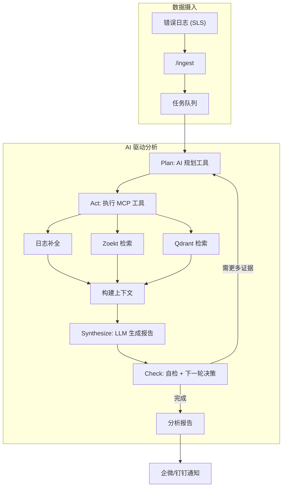

# RootSeeker

<p align="center">
    
    
    
    
</p>

<p align="center">
  <strong><a href="README.md">中文</a></strong> | <strong><a href="README.en.md">English</a></strong>
</p>

**RootSeeker** 是一个面向公司内网的 **AI 驱动错误分析与根因发现服务**。v2.0.0 将主流程升级为 **Plan → Act → Synthesize → Check** 多轮迭代，由 AI 自主决策调用哪些工具、收集哪些证据，像人类专家一样逐步逼近根因。

通过集成 **MCP 网关**、**SLS (日志)**、**Zoekt (精确代码检索)**、**Qdrant (语义向量检索)** 和 **LLM (大模型推理)**，RootSeeker 能够自动还原故障现场，定位问题代码，并生成专家级的修复建议。

> **如果觉得这个项目对你有帮助，请帮忙点个 Star ⭐️，你的支持是我们更新的动力！**

> 📮 **项目快速迭代中**：如果您有任何需求或建议，欢迎通过 [Issue](https://gitee.com/icey_1/root_seeker/issues) 提交，我们会优先考虑您的反馈。也可联系：**wuhun0301@qq.com**

---

## 📚 目录

- [为什么选择 RootSeeker？](#-为什么选择-rootseeker)
- [核心特性](#-核心特性)
- [v2.0.0 架构](#-v200-架构)
- [工作原理](#-工作原理)
- [快速开始](#-快速开始)
- [配置说明](#-配置说明)
- [部署文档](#-部署文档)
- [API 参考](#-api-参考)
- [案例分析](#-案例分析)
- [贡献指南](#-贡献指南)
- [License](#-license)

---

## 🚀 为什么选择 RootSeeker？

传统的故障排查往往依赖人工经验，SRE 需要在日志平台、监控系统和 IDE 之间反复横跳，耗时耗力。RootSeeker 旨在解决以下痛点：

*   **告别“通灵”式 Debug**：不再对着报错堆栈瞎猜，直接定位到具体的代码行。
*   **全息现场还原**：自动关联 TraceID，拉取同一链路上的所有上下文日志（API 入参、SQL、RPC）。
*   **懂你的私有代码**：构建私有代码索引，即使是复杂的业务逻辑，AI 也能通过语义搜索理解意图。
*   **多轮侦探推理**：AI 自主规划工具调用顺序，通过多轮追问和二次检索，逐步逼近根因。

---

## ✨ 核心特性

- **🤖 AI 驱动主流程**：Plan → Act → Synthesize → Check 多轮迭代，勘探优先，失败自动回退直连路径。
- **🔌 MCP 网关**：应用内极简网关，工具注册/发现/执行；支持外部 MCP Server（stdio/streamable-http）扩展。
- **🔍 双引擎代码检索**：结合 Zoekt（正则/符号）和 Qdrant（向量语义），兼顾精确匹配与意图理解。
- **📦 evidence.context_search**：在已收集证据上下文中检索，避免重复调用 code.search/correlation。
- **🔗 全链路日志补全**：自动从阿里云 SLS 等源拉取上下文，还原故障发生时的完整数据流。
- **📡 多渠道触达**：分析报告实时推送至企业微信、钉钉，支持 Markdown 格式。
- **🛡️ 数据安全**：支持私有化部署，代码和日志不出内网（可对接本地 LLM）。
- **🪝 Hook 体系**：AnalysisStart、PreToolUse、PostToolUse 等，支持自定义脚本注入分析生命周期。

---

## 🆕 v2.0.0 架构

v2.0.0 将主流程从「直接调用内部接口」改为 **AI 驱动**，由 AI 自主决策工具调用顺序与证据收集策略。

### MCP 工具

| 工具 | 说明 |
|------|------|
| `index.get_status` | 获取仓库与索引概览 |
| `correlation.get_info` | 获取关联日志、Trace 链 |
| `code.search` | Zoekt 代码搜索 |
| `code.read` | 读取文件内容 |
| `evidence.context_search` | 在已收集证据中检索 |
| `deps.get_graph` | 依赖拓扑、调用链 |
| `analysis.synthesize` | 基于证据生成报告 |
| `analysis.run` / `analysis.run_full` | 全量分析（兜底） |

### AI 驱动流程

```
Plan（规划）→ Act（执行工具）→ Synthesize（生成报告）→ Check（自检 + 下一轮决策）
         ↑                                                              ↓
         └────────────── 若需更多证据，继续下一轮 ←─────────────────────┘
```

- **勘探优先**：细粒度工具（index/correlation/code.search/evidence.context_search/code.read）优先于全量 analysis.run。
- **失败回退**：任意 tool 失败或 Plan 解析失败时自动回退到直连路径，保证分析可用性。
- **上下文发现**：Plan 前预取 index/correlation，从 error_log 解析 trace_id、类名、方法名注入提示。

### AI 网关与 Hook

- **AI 网关**：动态切换/新增 LLM 配置（DeepSeek、豆包等），api_key 支持 `ENV:VAR_NAME` 引用。
- **Hook 体系**：`~/.rootseek/hooks/` + `config.hooks.dirs`，支持 AnalysisStart、AnalysisComplete、PreToolUse、PostToolUse。

详见 [docs/CHANGELOG_v2.0.0.md](docs/CHANGELOG_v2.0.0.md)。

---

## 🛠️ 工作原理



1.  **Ingest**：接收报错，入队分析任务。
2.  **Plan**：AI 规划本轮要调用的工具（index/correlation/code.search/evidence.context_search/code.read 等）。
3.  **Act**：执行器按计划调用 MCP 工具，收集证据。
4.  **Synthesize**：将工具结果转为证据，LLM 生成本轮报告。
5.  **Check**：自检覆盖性、一致性、可复现性；若需更多证据，AI 决策下一轮 Plan。
6.  **Report**：生成包含根因、证据和修复建议的最终报告。

---

## 🏁 快速开始

### 环境要求

| 组件 | 版本要求 | 说明 |
|------|----------|------|
| **Python** | ≥ 3.11 | 核心服务 |
| **JDK** | 8 | Admin 管理后台 |
| **Docker** | 20+ | 推荐部署方式 |

### 一键部署 (Docker)

```bash
# 1. 克隆仓库
git clone https://gitee.com/icey_1/root_seeker.git
cd root_seeker/root_seeker_docker

# 2. 启动服务 (自动处理配置)
bash start.sh
```

启动后访问：
*   **RootSeeker API**: `http://localhost:8000`
*   **Admin 后台**: `http://localhost:8080`

### 手动安装 (macOS/Linux)

```bash
# 1. 复制配置
cp config.example.yaml config.yaml

# 2. 安装依赖
bash scripts/install-without-docker.sh

# 3. 启动所有服务
bash scripts/start-all-one-click.sh
```

---

## ⚙️ 配置说明

### 启用 AI 驱动（默认）

```yaml
# config.yaml
ai_driven_enabled: true   # 默认 true，优先走 AI 驱动
max_analysis_rounds: 20  # 多轮迭代上限
```

### LLM 配置

```yaml
llm:
  kind: deepseek
  base_url: "https://api.deepseek.com"
  api_key: "ENV:DEEPSEEK_API_KEY"  # 支持环境变量引用
  model: "deepseek-chat"
```

### Hook（可选）

```yaml
hooks:
  enabled: true
  dirs: ["data/hooks"]  # 额外 Hook 目录
```

脚本放置于 `~/.rootseek/hooks/` 或 `config.hooks.dirs`，详见 [Hook体系说明.md](docs/Hook体系说明.md)。

---

## 📖 部署文档

| 文档 | 说明 |
|------|------|
| [配置参考](docs/components/00-配置参考.md) | `config.yaml` 全解 |
| [阿里云 SLS 集成](docs/components/03-阿里云SLS.md) | 日志源配置 |
| [LLM 配置](docs/components/04-LLM配置.md) | DeepSeek/OpenAI/豆包接入 |
| [通知配置](docs/components/07-通知配置.md) | 企微/钉钉机器人 |
| [v2.0.0 更新说明](docs/CHANGELOG_v2.0.0.md) | MCP 网关、AI 驱动、Hook 体系 |
| [Hook 体系](docs/Hook体系说明.md) | 分析生命周期自定义脚本 |
| [文档索引](docs/文档索引.md) | 更多文档 |

---

## 🔌 API 参考

| 接口 | 方法 | 说明 |
|------|------|------|
| `/ingest` | POST | 提交错误日志进行分析 |
| `/ingest/aliyun-sls` | POST | 接收 SLS Webhook 回调 |
| `/analysis/{id}` | GET | 查询分析报告结果 |
| `/mcp/tools` | GET | 列出 MCP 工具 |
| `/mcp/call` | POST | 执行 MCP 工具 |
| `/git-source/repos` | GET | 获取仓库列表 |
| `/index/status` | GET | 索引状态 |

更多接口请查看 Swagger UI：`http://localhost:8000/docs`。

---

## 💡 案例分析

> **场景**：线上交易服务突发 `NullPointerException`。
>
> **RootSeeker v2.0.0 的表现**：
> 1.  **Plan**：AI 规划先调用 index.get_status、correlation.get_info 获取上下文，再 code.search 定位 DiscountCalculator。
> 2.  **Act**：执行器按计划调用工具，Zoekt 定位到 `DiscountCalculator.java` 第 89 行，Qdrant 发现该类新增了 `@Autowired private VipStrategy vipStrategy;`。
> 3.  **Synthesize**：LLM 结合日志与代码证据，指出该类由 `new` 手动实例化，导致 Spring 注入失败。
> 4.  **Check**：自检通过，输出最终报告。
> 5.  **报告**：30 秒内推送至企微/钉钉，建议改为 Spring 托管或构造函数注入。

---

## 🤝 贡献指南

欢迎提交 Pull Request 或 Issue！

1.  Fork 本仓库
2.  新建 Feat_xxx 分支
3.  提交代码
4.  新建 Pull Request

---

## 📄 License

Apache 2.0 License © 2026 RootSeeker Team

---

**如果这个项目帮到了你，请给一个 Star ⭐️ 支持一下！**
