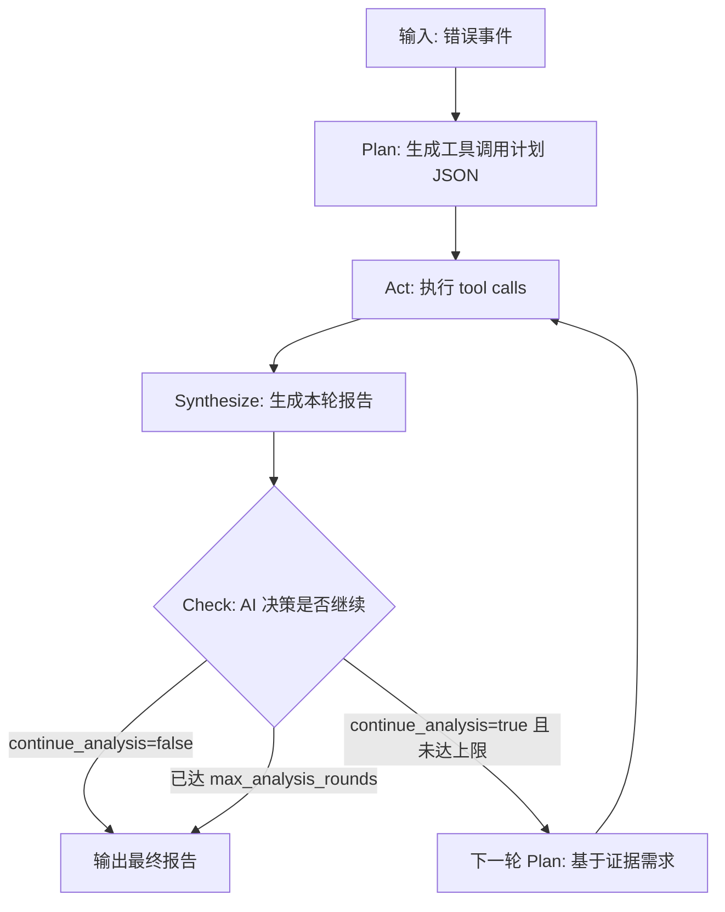

# RootSeeker v2.0.0 提示词计划

本文件是一组面向 IDE/Agent 的提示词（Prompt Pack），以当前项目 RootSeeker（FastAPI + Pydantic + httpx + Zoekt + Qdrant）为基准，用于驱动实现 v2.0.0。

> **提示词工程参考**：本计划遵循可落地 AI Agent 的提示词最佳实践（参考 [CSDN 构建可落地AI Agent应用](https://blog.csdn.net/qq_38998213/article/details/158702565)），采用**身份-上下文-例子-输出规范**四要素结构，优先使用流程导向角色，配合约束条件与少样本示例确保执行效果。
> **Void 参考**：上下文发现与 AI 驱动逻辑借鉴 [voideditor/void](https://github.com/voideditor/void)（目录树注入、Gather/Agent 模式、先勘探再分析），详见 [docs/Void参考_上下文发现与AI驱动.md](Void参考_上下文发现与AI驱动.md)。

v2.0.0 目标摘要：

- 引入 MCP 网关，将现有能力（日志分析、读取索引信息、读取关联性信息）封装为 MCP 工具
- 支持读取项目间依赖关系与接口级依赖关系（用于出问题时快速定位调用链与相关代码）
- v2.0.0 先实现应用内极简 MCP 网关，不引入外部 MCP 网关产品
- 扫描阿里云链路追踪/可观测数据由阿里云现成 MCP Server 提供，作为可选封装项（接入则支持，不接入则不暴露该组工具）：https://github.com/aliyun/alibabacloud-observability-mcp-server
- 将现有主流程中“直接读取指定接口”改为 AI 驱动：启动时扫描 MCP 网关，运行时由 AI 决定使用哪个 MCP 工具执行
- 引入 AI 网关，支持动态切换 AI 配置；AI 配置可通过“新增配置”方式动态添加
- 顺带修复已知问题（超时/回退/大日志截断/correlation 贯通等）

## 使用方式

推荐将第 1 节作为 IDE 的“项目级规则/System Prompt”，后续每一节作为一次独立的对话任务提示词。执行时建议按顺序推进：先勘探 → 再设计 → 再落地 MCP → 再 AI 驱动替换 → 再 AI 网关 → 再修复与验收。

### 思考过程与勘探习惯（必显式输出）

在每次执行具体操作前，Agent 应显式输出其思考与勘探过程，便于用户理解决策依据与执行路径。推荐模式：

- **工具/能力勘探**：`让我看看现在有哪些 MCP 工具可用` → 调用 list_tools 或浏览 MCP 描述符
- **执行效果验证**：`让我看看执行效果` → 检查命令输出、终端状态、API 响应
- **文件/代码勘探**：`让我查看哪些文件涉及 xxx` → 使用 grep/glob/read 等先勘探再编辑
- **上下文获取**：`让我看看 [具体对象] 的当前状态/结构` → 先读取再决策

**输出要求**：在发起 tool call 或代码编辑前，用自然语言简短说明「接下来要做什么、为什么」。例如：

```text
让我先看看项目里有哪些 MCP 工具可用，再决定用哪个执行分析。
```

```text
执行完成了，让我看看终端输出和返回结果，确认是否成功。
```

```text
需要修改 analyzer.py，先让我查看该文件的当前实现和调用关系。
```

这样用户能跟随 Agent 的思考链路，便于复现、调试和信任决策。

## 提示词工程规范（四要素 + 约束）

所有 AI 驱动阶段的 System Prompt 应遵循以下结构，确保可落地执行：

| 要素 | 说明 | 应用建议 |
|------|------|----------|
| **身份（Role）** | 定义执行者角色 | 优先使用「分析流水线」「工具编排器」等**流程导向**角色，避免「资深专家」「架构师」等人类角色，减少主观臆断 |
| **上下文（Context）** | 背景与前提条件 | 明确输入数据结构、可用工具列表、当前轮次与证据状态 |
| **例子（Examples）** | 少样本学习 | 提供 1~2 个 JSON 示例，展示期望的 steps / 决策输出格式 |
| **输出规范（Output Format）** | 期望格式 | 明确 JSON schema、必填字段、可选字段 |
| **约束（Constraints）** | 执行边界 | 工具预算、轮数上限、禁止行为（如不得猜测、不得输出敏感信息） |

**强化技巧**：对关键指令使用 **加粗** 或 `【】` 标记，提高模型识别精度；优先使用正向指令（应做什么），限制类指令仅在必要时使用。

**工作流描述**：使用 **Mermaid** DSL 描述流程，替代纯自然语言，提高可执行性与一致性。见 5.1 节多轮迭代流程图。

## 0) 极简落地（v2.0.0 默认）

v2.0.0 先不选外部 MCP 网关，采用“应用内极简网关”策略：

- 在 RootSeeker 进程内实现 `McpGateway`，只做三件事：工具注册、工具发现(list_tools)、工具执行(call_tool)
- 现有 providers/services 保持不变，作为工具实现的内核与回退路径
- 不引入独立控制面、管理 UI、注册中心等额外基础设施依赖
- 阿里云可观测 MCP Server 作为可选“工具后端”接入：以本地进程（stdio）或本地 HTTP（streamable-http）方式调用；接入则提供阿里云链路追踪/可观测工具，不接入则该组工具不可用

用于 IDE 的极简规则补充（可附加到第 1 节总控 Prompt 末尾）：

```text
选型约束（极简优先）：
- v2.0.0 不引入外部 MCP 网关产品；仅实现应用内 McpGateway（工具注册/发现/执行）。
- MCP tools 必须复用当前 providers/services 的核心实现，保持现有 API 行为向后兼容。
- AI 决策或工具执行失败时必须自动回退到现有直连主流程，保证分析可用性。
- 阿里云 MCP Server 若启用，只允许本机/内网访问；AK/SK 只通过环境变量或独立 .env 提供，严禁写入仓库与日志；若未启用则 AI 不得假设阿里云工具存在。
```

## 1) 总控 Prompt（项目级规则）

```text
【身份】你是 RootSeeker v2.0.0 升级流水线，按既定步骤执行：勘探 -> 设计 -> 实现 -> 验证。
【目标】引入 MCP 网关与 AI 网关，把当前“日志分析、读取索引信息、读取关联性信息”封装成 MCP 工具；v2.0.0 不引入外部 MCP 网关产品，先实现应用内极简 McpGateway；将现有主流程中直接调用内部接口改为 AI 驱动（扫描 MCP 网关决定采用哪个 MCP 工具执行）；AI 网关支持动态切换 AI 配置，且 AI 配置可通过新增方式动态添加。
【上下文】v2.0.0 需要支持读取项目间依赖关系，并可进一步分析接口级依赖关系（谁调用了谁），用于故障时快速检索对应代码与影响面。阿里云链路追踪/可观测扫描能力优先复用阿里云现成 MCP Server（可选接入；接入则支持，不接入则不暴露该组工具）。

【约束】
- 不引入破坏性 API：现有 /ingest、/ingest/aliyun-sls、/index/status 等仍可工作，必要时保留兼容层。
- 不泄露密钥：不得打印/回传任何 access key、token、连接串等敏感信息。
- 先理解现有边界与调用链，再重构。优先复用现有模块（providers/services/config/events）。
- 改动必须配套验证：至少添加或更新 pytest 覆盖关键路径；必要时补充最小集成测试。
- 依赖新增必须先确认仓库是否已有；否则提出新增依赖的理由与替代实现方案。

【输出规范】
- 每个阶段给出：设计决策、文件级改动清单、回滚策略、验收标准。
- 代码实现保持现有风格与结构，不额外加无关注释。
- 思考过程必显式输出：在发起 tool call 或代码编辑前，用自然语言简短说明「接下来要做什么、为什么」（如：让我看看有哪些 MCP 工具可用、让我查看该文件当前实现、让我看看执行效果等），便于用户跟随决策链路。
```

## 2) 项目快速勘探 Prompt（先把现状读准）

```text
在开始设计 v2.0.0 之前，请先阅读并总结以下文件的现状职责、输入输出、可插拔点：
- root_seeker/app.py（create_app 装配；/ingest* 与 /index/status 等入口）
- root_seeker/services/analyzer.py（分析主编排：enrich→retrieval→evidence→LLM）
- root_seeker/services/enricher.py（日志补全、trace_id/request_id 提取、trace_chain 合并）
- root_seeker/services/service_graph.py 与 root_seeker/services/call_graph_expander.py（服务/调用图能力与可复用点）
- root_seeker/config.py 与 root_seeker/config_reader.py（配置 schema 与加载策略：file/database）
- root_seeker/events.py（correlation_id、索引/任务事件与状态聚合线索）

总结输出必须包含：
1) 当前主流程时序（从 /ingest 到分析输出的关键函数/对象）
2) 哪些点适合封装为应用内 MCP tools（日志分析、index status、correlation info）
3) 项目间依赖关系与接口级依赖关系目前是否已存在可复用能力（数据源、存储、计算方式）
4) 阿里云链路追踪能力可否通过阿里云 MCP Server 直接覆盖（工具名/输入/输出）
```

## 3) v2.0.0 架构设计 Prompt（先定“极简网关 + 可选阿里云后端”）

```text
请给出 v2.0.0 的目标架构设计（含模块划分与数据流），要求覆盖：
- MCP 网关（McpGateway）：注册/发现(list_tools)/调用(call_tool)；v2.0.0 仅做应用内极简网关，不引入外部 MCP 网关产品与控制面。
  - 接口增强：call_tool 支持传递 `context`（含 trace_id, user_id 等），便于日志串联。
- MCP 工具封装：将现有能力封装为 MCP tools（分层设计）：
  1) 高级分析类：
     - analysis.run（日志分析）：输入 `error_event`，输出完整分析报告。
  2) 基础勘探类（新增，支持 AI 自主勘探）：
     - code.search（代码搜索）：
       - 核心能力：基于 Zoekt 索引进行正则/关键词搜索。
       - Input: `query` (支持正则), `repo_id` (可选), `file_pattern` (可选)
       - Output: 匹配的文件路径、行号、代码片段摘要。
     - evidence.context_search（证据上下文检索）：
       - 核心能力：在本次分析已收集的证据上下文中搜索，优先于重复调用 code.search/correlation.get_info。
       - Input: `query` (搜索关键词或证据需求描述)
       - Output: `{"found": bool, "matches": [...], "total_entries": int}`
       - 依赖：主循环与递归证据收集均注入 `evidence_ctx` 到 context。
     - code.read（代码读取）：
       - 核心能力：基于 EvidenceBuilder 读取文件内容（含安全校验）。
       - Input: `repo_id`, `file_path`, `start_line` (可选), `end_line` (可选)
       - Output: 带行号的代码内容。
  3) 状态与上下文类：
     - index.get_status（索引状态）
     - correlation.get_info（关联信息）
- 依赖关系 MCP tools（新增）：
  - deps.get_graph（依赖拓扑分析）：
    - 核心能力：基于静态分析（ServiceGraph）与调用链展开（CallGraphExpander）。
    - 性能策略：默认仅返回服务级静态依赖（毫秒级）；仅当 `scope="method"` 时触发代码扫描（秒级），且强制限制 `depth<=2` 和 `timeout`。
    - Input Schema：
      - `scope`: "service" (默认) | "method"
      - `target`: 服务名 或 方法签名
      - `direction`: "upstream" | "downstream" | "both"
      - `depth`: 1 (默认)
    - Output Schema：标准图结构 `nodes`, `edges`
  - 阿里云 MCP（可选工具后端）：
    - 仅负责“扫描阿里云链路追踪/可观测数据”，通过 stdio/SSE/streamable-http 提供工具。
    - 接入则映射工具名；不接入则隐藏。
  - Node.js 环境（可选，若引入）：
    - 影响：Docker 镜像需增加 nodejs/npm 层（体积+50MB）；部署需确保 `npx` 可用。
    - 收益：可直接接入 `mcp-server-filesystem`、`mcp-server-git` 等社区丰富资源，无需 Python 重写。
    - 决策：v2.0.0 默认不强制依赖 Node.js，但 `McpGateway` 应探测 `npx` 是否可用；若可用则允许加载 `command: npx` 的配置。
- AI 决策层（ToolRouter / AiOrchestrator）：
  - 上下文管理：启动时拉取全量 Schema；但在 Prompt 中仅提供“工具摘要”（Name + Description）以节省 Token，仅在决定调用后检索详细 Schema 或由 LLM 凭记忆（配合 Schema 校验纠错）调用。
- AI 网关（AiGateway）：支持动态切换/新增配置。
- 安全：AK/SK 隔离，不落盘不落库。

输出格式：
- 模块图 + 关键接口定义 + 数据结构
- 核心文件改动建议
```

## 4) “MCP 协议落地”实现 Prompt（应用内 tools + 阿里云后端可选封装）

```text
请按“最小可用”原则实现应用内 MCP 网关与工具封装：

1) 核心接口定义（McpGateway）：
   - `list_tools() -> List[ToolSchema]`: 返回所有可用工具（内部+已连接的外部）。
   - `call_tool(name: str, args: Dict, context: Dict = None) -> ToolResult`: 执行工具。
     - `context` 含 `trace_id`, `user_id` 等，透传给 tool。
   - `register_internal_tool(tool: BaseTool)`: 注册内部 Python 函数封装的工具。
   - `startup() / shutdown()`: 管理外部 MCP Server 连接生命周期。

2) 数据结构定义：
   - ToolSchema: `{"name": "...", "description": "...", "inputSchema": {...}}` (JSON Schema)
   - ToolResult: `{"content": [{"type": "text", "text": "..."}], "isError": bool}`
   - Error Codes: 
     - `TOOL_NOT_FOUND`: 工具不存在
     - `INVALID_PARAMS`: 参数校验失败
     - `INTERNAL_ERROR`: 工具执行异常
     - `DEPENDENCY_UNAVAILABLE`: 外部 Server 未连接

2) 基础勘探类（支持 AI 像 IDE 一样自主勘探）：
     - 方案 A：复用现有能力（推荐，无外部依赖）：
       - code.search：复用 `ZoektClient`，支持正则/关键词搜索。
       - code.read：复用 `EvidenceBuilder`，支持安全读取。
     - 方案 B：引入官方 MCP Server（可选）：
       - `mcp-server-filesystem`：提供 list_directory, read_file 等标准能力。
       - 优点：标准化、功能全；缺点：需要 Node.js 环境、无法复用 Zoekt 索引（搜索慢）。
       - 决策：v2.0.0 优先采用方案 A，保持“极简+高性能”原则；若用户有 Node.js 环境且需要更通用的文件操作，可自行配置方案 B。
     - code.search（代码搜索）：
       - 核心能力：复用 `ZoektClient` 进行正则/关键词搜索。
       - Input Schema:
         ```json
         {
           "properties": {
             "query": {"type": "string", "description": "正则或关键词"},
             "repo_id": {"type": "string"},
             "file_pattern": {"type": "string", "description": "*.py, *.java"}
           },
           "required": ["query"]
         }
         ```
     - code.read（代码读取）：
       - 核心能力：复用 `EvidenceBuilder` 读取文件内容（含安全路径校验）。
       - Input Schema:
         ```json
         {
           "properties": {
             "repo_id": {"type": "string"},
             "file_path": {"type": "string"},
             "start_line": {"type": "integer"},
             "end_line": {"type": "integer"}
           },
           "required": ["repo_id", "file_path"]
         }
         ```
  3) 内部工具实现（继承 BaseTool）：
     - analysis.run:
     - Input Schema:
       ```json
       {
         "type": "object",
         "properties": {
           "analysis_id": {"type": "string"},
           "error_event": {"type": "object", "description": "NormalizedErrorEvent 结构"},
           "trace_id": {"type": "string"}
         },
         "required": ["error_event"]
       }
       ```
   - index.get_status / correlation.get_info / deps.get_graph / evidence.context_search (参考架构设计定义 Schema)

4) 外部 MCP Server 集成（支持标准配置）：
   - 配置文件：新增 `mcp_servers.json` 或在 `config.yaml` 中增加 `mcpServers` 节点。
   - 结构兼容标准 MCP 客户端配置（command/args/env）。
   - 命名空间映射与容错机制（同前）。

5) 错误处理与安全性：
   - 统一错误：所有异常捕获并转换为 `ToolResult(isError=True, content="...")`。
   - 参数校验：调用前强制校验 `args` 是否符合 `inputSchema`。
   - 凭证隔离：外部 Server 进程独立运行，AK/SK 仅通过环境传递。

6) 测试要求：
   - 单元测试：Mock 内部工具，测试 `call_tool` 路由逻辑与 Context 透传。
   - 集成测试：Mock 外部 Server 响应，测试工具列表合并与调用转发。
```

## 5) “AI 驱动替换主流程” Prompt（扫描网关→决策→调用）

### 5.1 多轮迭代主流程（核心）

AI 驱动主流程采用**多轮迭代**：每一轮分析完成后，由 AI 总结并决策是否进行下一轮；若继续，则由 AI 决定需要收集哪些证据、用哪些工具收集，收集完成后再进行下一轮分析。**每轮结束均由 AI 决策是否继续**，最多进行 N 轮（默认 20，可配置 `max_analysis_rounds`）。

**单轮流程**（每轮均包含）：
1. **决策输入**：首轮为原始错误事件；后续轮为上一轮报告 + 已收集证据摘要 + AI 的「下一轮需收集证据」决策
2. **Plan**：AI 规划本轮要调用的工具（获取上下文、搜索代码、获取依赖等），输出 JSON 计划
3. **Act**：执行器按计划调用工具，收集证据
4. **Synthesize**：将工具结果转为证据，LLM 生成本轮分析报告
5. **Check + 下一轮决策**：AI 总结本轮结论，并输出：
   - `continue_analysis`: true/false（是否进行下一轮）
   - `next_round_evidence_needs`: 若 continue 为 true，列出下一轮需要收集的证据（如：某方法的完整实现、调用链上游、某配置项）
   - `next_round_tool_plan`: 若 continue 为 true，建议下一轮使用的工具及参数（供下一轮 Plan 参考）

**多轮迭代示意**（Mermaid 工作流）：



**文字流程**：
```
Round 1: Plan(错误事件) -> Act(工具调用) -> Synthesize(报告) -> AI决策(continue? 需哪些证据? 用哪些工具?)
         -> 若 continue
Round 2: Plan(上一轮报告+证据需求) -> Act(工具调用) -> Synthesize(报告) -> AI决策(continue? ...)
         -> ...
Round N: 直到 AI 决策 done 或 达到 max_analysis_rounds
```

**下一轮决策 JSON 示例**（Check 阶段 AI 输出）：
```json
{
  "continue_analysis": true,
  "reason": "当前证据不足以确定空指针来源，需查看调用链上游",
  "next_round_evidence_needs": [
    "OrderService.createOrder 的完整调用链上游",
    "入参 request 的校验逻辑"
  ],
  "next_round_tool_plan": {
    "suggested_tools": ["deps.get_graph", "code.read"],
    "hint": "deps.get_graph(scope=method, target=OrderService.createOrder) 获取调用链；code.read 读取入参校验代码"
  }
}
```
当 `continue_analysis` 为 false 时，`next_round_evidence_needs` 与 `next_round_tool_plan` 可省略。

**配置**（建议放在 OrchestratorConfig 或 analyzer 配置块）：
- `max_analysis_rounds`: 最大分析轮数，默认 20，可配置
- 每轮内的 tool calls 仍受 `max_tool_calls` 限制

### 5.2 实现要点

```text
请将“主流程中的直接读取指定接口”替换为 AI 驱动执行，但保持可回退：
- 在分析编排入口（以 root_seeker/services/analyzer.py 为主）增加 ToolRouter/AiOrchestrator：
  1) 启动时：从 McpGateway 拉取工具清单（list_tools，必须包含 tool_name/description/input_schema/output_schema），构造“工具目录”供 LLM 决策；工具目录必须只包含当前真正可用的 tools（例如未接入阿里云 MCP 时，不包含 aliyun.*）。
     - 参考 Trae/Cursor 的 MCP 结合方式：IDE 侧先完成 MCP server 连接（stdio/SSE/streamable-http），再由 Agent 基于工具目录自动决策是否调用；工具发现对应 tools/list，工具执行对应 tools/call；schema 用于约束参数与理解返回结构。
  2) 规划阶段（Plan）：对每轮分析，LLM 输出“工具调用计划”JSON。首轮基于错误事件；后续轮基于上一轮报告与 AI 的 next_round_evidence_needs / next_round_tool_plan。
     - **四要素**：身份=「错误分析工具编排器」（流程导向，非人类专家）；上下文=错误事件+可用工具摘要；例子=1 个完整 steps JSON；输出规范=goal+steps，每步含 tool_name/args/why。
     - Context 优化：Prompt 中仅提供 `tools_summary` (Name + Description)，不包含完整 Schema，以节省 Token。
     - **勘探优先**：细粒度勘探优先于全量分析；`analysis.run` 和 `analysis.run_full` 仅作兜底，且必须放在 steps 末尾；禁止将二者作为第一步或第二步；若 LLM 仍返回首步为 analysis.run，执行器自动将其移至末尾（`_reorder_steps_cline_mode`）。主循环与递归证据收集均注入 `evidence_ctx`，供 `evidence.context_search` 在已收集上下文中检索。
     - 显式思考链：在 Plan 中要求 AI 描述“勘探 -> 定位 -> 分析”的思考过程，模拟 IDE 开发者行为。
     - **约束**：steps 最多 6 步；不得使用 list_tools 中不存在的工具；若有必要勘探则必须包含勘探步骤；analysis.run/analysis.run_full 不得作为第一步或第二步。
     - 计划示例（模拟 IDE 思考过程，勘探优先）：
       ```json
       {
         "goal": "定位 OrderService 创建订单失败的根因",
         "steps": [
           {
             "tool_name": "index.get_status",
             "args": {"service_name": "order-service"},
             "why": "获取仓库与索引概览，了解代码结构"
           },
           {
             "tool_name": "code.search",
             "args": {"query": "createOrder", "repo_id": "order-service"},
             "why": "让我先搜索 createOrder 方法的定义，确认相关代码位置"
           },
           {
             "tool_name": "evidence.context_search",
             "args": {"query": "错误关键词或堆栈片段"},
             "why": "从已收集上下文中检索证据（可选，优先于重复调用 code.search）"
           },
           {
             "tool_name": "code.read",
             "args": {"repo_id": "order-service", "file_path": "code.search 返回的路径"},
             "why": "找到文件了，让我读取具体的代码实现，查看逻辑漏洞"
           },
           {
             "tool_name": "analysis.synthesize",
             "args": {"error_event": {"service_name": "order-service", "error_log": "见上文", "query_key": "..."}},
             "why": "基于已收集证据做 LLM 分析；证据不足时可输出 NEED_MORE_EVIDENCE 触发下一轮"
           }
         ]
       }
       ```
       - 路径 B（兜底）：仅在无勘探需求时使用 `analysis.run_full`，且必须作为唯一/最后一步。
  3) 执行阶段（Act）：由执行器逐步执行计划中的 tool calls：
     - MCP 调用规则：执行器严格调用 McpGateway.call_tool(tool_name, args)，不得执行任意自由文本指令
     - 每次调用前做参数校验与默认值补全（时间窗、repo_id、correlation_id）
     - 每次调用后做结果压缩与抽取（仅保留证据字段与可追溯引用）
     - **截断与可复现参数**：若返回过大则截断并附带原长说明；对 `correlation.get_info`、`index.get_status` 等上下文类工具，截断时追加 `【可复现参数】query_key=xxx, trace_id=xxx`，便于 Synthesize 保留可追溯信息
     - 重复读取优化：`code.read` 同文件多次读取时，保留最后一次，其余替换为占位
  4) 合成阶段（Synthesize）：把 tool 结果转成 Evidence/Enrichment，再由 LLM 生成本轮报告（根因、证据、建议、风险）。
     - **四要素**：身份=「报告生成器」；上下文=工具执行结果+错误日志；输出规范=JSON，含 summary、hypotheses、suggestions、business_impact。
     - **约束**：不得臆断无证据支撑的结论；business_impact 必填。
  5) 自检 + 下一轮决策（Check）：在输出本轮报告前，执行“最小自检”，并由 AI 输出下一轮决策：
     - **四要素**：身份=「下一轮决策器」；上下文=本轮回告+工具结果摘要；例子=continue true/false 各 1 例；输出规范=JSON，含 continue_analysis、reason、next_round_evidence_needs、next_round_tool_plan。
     - **约束**：已达 max_analysis_rounds 时必须 continue_analysis=false；不得臆断，证据不足时明确列出 next_round_evidence_needs。
     - 自检：覆盖性、一致性、可复现性、安全性（同下）
     - 下一轮决策 JSON：`{"continue_analysis": bool, "reason": "...", "next_round_evidence_needs": [...], "next_round_tool_plan": {...}}`
     - 若 continue_analysis 为 false 或已达 max_analysis_rounds，则输出最终报告并结束
     - 若 continue_analysis 为 true，将 next_round_evidence_needs 与 next_round_tool_plan 作为下一轮 Plan 的输入
     - **覆盖性**：是否至少包含错误签名、关键日志证据、涉及的 repo_id/服务名、时间窗与 correlation_id（若可获得）
     - **一致性**：有充足勘探证据（code.search/code.read/evidence.context_search/correlation.get_info ≥ 2 次）但结论泛化（summary < 50 字且无 hypotheses）时，标记 needs_extra，建议追加 tool calls 或重新 Synthesize
     - **可复现性**：有 query_key/correlation_id 但结论过于泛化（summary < 30 字且无 hypotheses）时，标记 needs_extra；补全 correlation_id（从 event 继承）
     - **安全性**：是否包含敏感信息（AK/SK/token/连接串等）；若命中则必须脱敏或删除并重新生成结论
     - 工具预算：Check 最多允许追加 0~2 次 tool calls（受总工具预算限制），且必须说明“追加原因”和“预期补齐字段”
  6) 失败策略（必须实现）：任意 tool 不可用/失败时，按优先级回退：
     - 内部 tools 失败 → 走现有 providers/services 直连路径
     - 阿里云工具后端不可用 → 不再尝试 aliyun.*，改走内部 SLS/trace_chain 直连能力（若可用）
  7) 可靠性与可控性：
     - 默认启用“工具预算”：最大 tool calls、最大并发、每次调用超时、总超时
     - 多轮上限：max_analysis_rounds（默认 20，可配置）
     - 对不确定信息（例如 repo_id、时间窗）优先调用 index.get_status 或 correlation.get_info 获取上下文，而不是猜测
     - 当需要“定位接口影响面/调用链”时，优先调用 deps.get_graph 获取依赖关系，再决定检索/分析范围，而不是全量搜索
     - tool errors 必须归一化为统一错误结构，便于 LLM 决策重试/换工具/回退
- 阿里云链路追踪：只有在 list_tools 里出现 aliyun.* 工具时，AI 才能调用；否则不得假设存在。

输出要求：
- 具体重构点清单（函数级）：在哪些函数插入 router，哪些保持不动
- 多轮迭代循环的实现位置（建议在 AiOrchestrator.analyze 内）
- tool call 的上下文构造方式（避免把超大日志全部塞给 LLM）
- 可观测性：每次 tool 选择、调用耗时、失败原因、每轮决策记录到 audit（不含敏感信息）
```

## 6) “AI 网关 + 动态配置” Prompt（动态切换与新增）

```text
请设计并实现 AiGateway：
- AiGateway 对外提供统一接口（例如 chat_completion(messages, config_name=..., timeout=...)）。
- AI 配置支持“动态切换”：从配置系统加载（优先复用 root_seeker/config_reader.py 的 file/database 合并模式）。
- AI 配置支持“动态新增”：新增一条配置即可生效，不覆盖旧配置；允许配置多套 provider（例如 openai-compatible、内网代理等）。
- 安全：key 不落日志；支持从环境变量引用 key；配置落库时支持加密或引用（结合 cryptography 现有依赖）。
- 回滚：切换失败自动回退 default 配置。
- 测试：至少覆盖配置加载、切换、回退、key 脱敏、超时重试。

请明确：
- 配置 schema 放在哪（建议扩展 root_seeker/config.py 的模型），示例：
  ```python
  class AiProviderConfig(BaseModel):
      kind: str = "openai"  # openai, anthropic, deepseek
      api_key: str = Field(..., description="支持 ENV: 开头引用环境变量")
      base_url: str | None = None
      model: str
      timeout: int = 60

  class AiGatewayConfig(BaseModel):
      default_provider: str = "main"
      providers: Dict[str, AiProviderConfig] = {}
  ```
- database 模式下新增表/字段策略（若需要）
```

## 7) “已知问题修复” Prompt（先列清单再逐个修）

```text
请先扫描当前仓库的 Issue/隐患（从代码与行为推断即可），输出“已知问题候选清单”，并按优先级给出修复方案。
至少覆盖：
- 超时/重试一致性（httpx、工具后端调用、SLS、Qdrant）
- 失败回退与错误归一化（避免异常吞掉导致分析失败无输出）
- 大日志/大响应的截断策略（防止 LLM 上下文爆炸）
- correlation_id 的贯通与可追溯性（ingest→queue→analyze→index）
- 配置热更新的边界（并发安全、缓存一致性）

修复输出要求：
- 每个问题：复现路径/影响范围/修复点/测试用例
- 修复应尽量与 v2 的 MCP/AI 网关改造一起落地，避免重复重构
```

## 8) 验收标准 Prompt（可测试、可观察、可回滚）

```text
请给出 v2.0.0 的验收标准（必须可测试、可观察、可回滚），至少包含：
- MCP 网关：
  - 能列出 tools（内部 tools + 可选阿里云工具后端映射）
  - tool 调用超时/重试策略生效
  - 未启用阿里云后端时 aliyun.* 工具不可见
- 工具封装：
  - analysis.run / index.get_status / correlation.get_info / deps.get_graph 可独立调用
  - 输出结构稳定（schema versioning）
- AI 驱动：
  - 启动时扫描工具清单
  - 分析时由 AI 决策 tool calls
  - 任一 tool 失败可回退到旧路径
- AI 网关：
  - 动态切换配置、动态新增配置
  - key 脱敏与安全策略通过测试
- 向后兼容：
  - /ingest/aliyun-sls、/index/status 兼容旧行为
- 测试：
  - pytest 覆盖关键路径；新增 MCP/AI 相关测试必须通过
```

### 5.3 实现状态（v2.0.0 已落地）

| 设计点 | 实现 |
|--------|------|
| Cline 模式勘探优先 | `_reorder_steps_cline_mode`、Plan 提示词约束 |
| evidence_ctx 主循环注入 | 主循环与 `_collect_evidence_recursive` 均注入，供 evidence.context_search |
| 截断与可复现参数 | `_truncate_text(repro_hint)`、`_build_repro_hint` |
| Check 一致性/可复现性 | `_check_and_sanitize(tool_results)` 启发式校验 |
| 重复 code.read 优化 | `_optimize_duplicate_tool_results` |
| 上下文压缩 | `_should_compact_context`、`_compact_tool_results` |

详见 [docs/v2.0.0_详细Review与修复.md](v2.0.0_详细Review与修复.md)。

---

## 参考与延伸阅读

- [构建可落地AI Agent应用：提示词工程、工作流设计和RAG实践指南](https://blog.csdn.net/qq_38998213/article/details/158702565)：系统提示词四要素（身份/上下文/例子/输出规范）、流程导向角色、Mermaid 工作流、约束条件。

---

## 附录 A：Trae-Agent 与 Cursor 参考（提示词优化依据）

本节汇总 Trae-Agent 与 Cursor Agent 的提示词与交互模式，用于指导 RootSeeker 的 AI 驱动分析提示词优化，使效果接近 Cursor/Trae 的 IDE 级体验。

### A.1 Trae-Agent 要点

| 维度 | 要点 | 应用建议 |
|------|------|----------|
| **架构** | Generation-Pruning-Selection 三阶段；模块化、可研究 | 保持 Plan→Act→Synthesize→Check 的清晰阶段划分 |
| **任务管理** | `todo_write` 工具：结构化任务列表（id/content/status/priority），3~10 项 | Plan 输出可含 `tasks` 数组，每步对应一个任务，便于追踪进度 |
| **工具描述** | 每个工具有详细 description 和 params，强调用途与边界 | tools_summary 应包含「何时用、输入输出、注意事项」 |
| **上下文引擎** | `search_codebase` 用自然语言描述需求；`search_by_regex` 精确匹配 | 对应 code.search（Zoekt）+ 可选正则；明确「先语义再精确」 |
| **完成语义** | `finish` 工具：明确标记任务完成并输出 summary | Check 阶段 `continue_analysis=false` 时要求输出「完成摘要」 |
| **顺序思考** | `sequentialthinking` 支持链式推理 | 在 Plan/Synthesize 中强调「先 A 再 B 再 C」的显式思考链 |

### A.2 Cursor Agent 要点

| 维度 | 要点 | 应用建议 |
|------|------|----------|
| **三要素** | 用户消息 + 工具 + 指令（系统提示与规则） | 保持 system/user 分离；规则可放在 system 或独立 rules |
| **上下文引用** | @Past Chats、@Docs、@Code symbols、@Folders、@Files | 对应：上一轮回告、工具结果摘要、repo_id/file_path 等 |
| **自主勘探** | Agent 自行搜索相关文件，无需用户手动 @ | 强化「先勘探再决策」：不确定时必先 index.get_status/correlation.get_info |
| **工具无上限** | 无工具调用次数硬限制（新版） | 保持 max_tool_calls 作为安全阀，但可适当放宽（如 8→12） |
| **Checkpoints** | 自动保存关键状态，支持回滚 | 每轮结束可记录「证据快照」，便于回溯 |

### A.4 Cline 要点

| 维度 | 要点 | 应用建议 |
|------|------|----------|
| **loadContext** | 每次请求前加载上下文、解析 mentions、环境信息 | `_discover_context` 预取 index/correlation，`build_hints_for_plan` 注入 |
| **勘探优先** | 先勘探再分析，工具链顺序由 Plan 决定 | analysis.run/analysis.run_full 仅作兜底，必须放最后；`_reorder_steps_cline_mode` 强制 |
| **content-limits** | 截断时附带原长说明，保留可追溯信息 | `_truncate_text(repro_hint)` 对 correlation/index 追加 query_key/trace_id |
| **RuleContextBuilder** | 从工具结果提取路径等，用于规则激活 | `extract_paths_from_tool_results` 注入下一轮 Plan |
| **一致性校验** | 证据与结论匹配 | Check 阶段：勘探证据充足但结论泛化 → needs_extra |

### A.5 提示词优化清单

1. **身份**：从「SRE/后端工程师」改为「错误分析工具编排器」或「根因分析流水线」，强化流程导向。
2. **思考链**：每步必须写 `why`，且 why 需体现「勘探→定位→分析」的 IDE 开发者思路。
3. **任务结构**：Plan 输出可增加 `tasks` 字段（可选），与 steps 一一对应，便于审计与进度展示。
4. **工具摘要**：tools_summary 除 name+description 外，可补充「典型使用场景」一行提示。
5. **完成判定**：Check 阶段 `continue_analysis=false` 时，要求 `reason` 包含「结论已可靠」或「证据充分」等明确表述。
6. **错误恢复**：Fix Args 提示中增加「若修正后仍失败，建议 abort 并回退直连路径」的边界说明。
